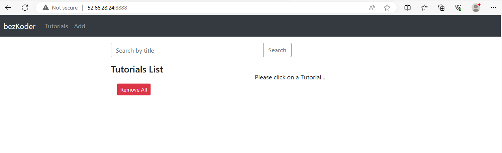

## Requirements 

- Deploy a MERN stack application on AWS EC2 Instance. Proxy the application using Nginx. Everything should be set up using Docker.
We should have a docker-compose.yml file which can be directly used to bootstrap the
application.

- Write an ansible file that can be used to setup docker and all other tools required to run
the docker-compose.yml file created in the previous step.

- Write a terraform file to start an instance on AWS.

Overall using the above files, we should be able to start an instance on AWS, configure it
using ansible and bootstrap the application on it.

## Prerequisites

- Create an AWS Free Tier Account

- Generate access key and secret key using IAM Service of AWS and copy them

- Configure your terminal with command, `aws configure`, and enter your access key and secret key

- Create an SSH key in your AWS Account and store it in your system as it will be used for logging in the system (Although, we can create it using Terraform script, but it is recommended to create it from console)

- Install Terraform in your system

## Solution

For these requirements, I created a tf file which is responsible for booting an AWS EC2 instance with corresponding vpc and security group as well.

This tf file contains a file provisioner, which will copy the file from local to EC2 instance and remote-exec provisioner will run that script.

This script will run in the EC2 instance at the time of booting which is responsible for installation of required tools like git and ansible.

Finally, script starts the application using docker-compose.

## Run the application

We can easily run the whole application now with following commands:

```
terraform init
terraform apply --auto-approve
```

## Output

This tf file will print the Public IP of EC2 instance on your console.

Open that IP in your browser on port `8888` and you will be able to see the Application.




